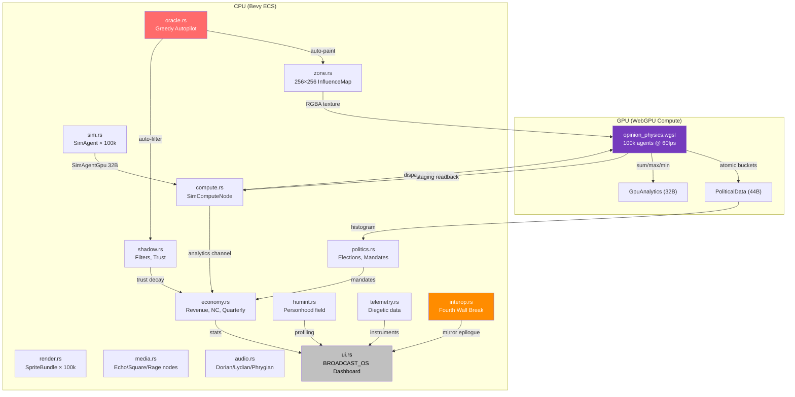

# SimSitting ☕️🟣

> **BROADCAST_OS v1.04** // 6:47 PM. The parking lot is empty. Revenue is up.

SimSitting is an interactive art project disguised as a media company simulator. 100,000 simulated agents. WebGPU compute shaders. Procedural audio. A UI that bleaches itself of personality as you optimize the humanity out of the population.

**Live at [miserable.work](https://miserable.work)**

## What Is This

You are a mid-level operator at a media company. Your workstation renders 100,000 opinion-bearing agents in real-time using GPU compute shaders. You paint "zones of influence" onto a 256×256 grid, place media nodes, run elections, hire government contracts, and lobby politicians — all to maximize quarterly revenue.

The twist: the game rewards you for destroying the thing you're managing. Echo Chambers increase revenue but polarize the population. Shadow Filters suppress moderates but erode Public Trust. The Oracle automates your job but removes your agency. When optimization reaches 100%, the simulation no longer needs you. The clock ticks from 6:47 PM to 6:48 PM. The parking lot goes silent.

## Architecture



## Modules

| Module | Lines | Tests | Purpose |
|---|---|---|---|
| `ui.rs` | 1726 | 14 | BROADCAST_OS dashboard, zone toolbar, election banner, Oracle unlock, Singularity screen, game legend, boot skip |
| `politics.rs` | 1048 | 47 | GPU opinion histogram, elections, mandates, government contracts, singularity detection |
| `telemetry.rs` | 771 | 38 | Diegetic telemetry instruments, audio degradation triggers |
| `humint.rs` | 755 | 39 | HUMINT profiler, personhood decay engine |
| `sim.rs` | 737 | 26 | SimAgent ECS components, GPU struct alignment, Deffuant-Weisbuch dynamics, population density clusters |
| `interop.rs` | 711 | 31 | Interop bridge, Fourth Wall Break, Mirror Epilogue |
| `oracle.rs` | 669 | 28 | Greedy autopilot, session history, psychographic profile, epilogue generator |
| `economy.rs` | 561 | 30 | Revenue model, Narrative Capital, quarterly reports, Consensus Trap audit |
| `zone.rs` | 476 | 22 | 256×256 influence map, zone types (Echo Chamber/Neutral Hub/Data Refinery), paint brush |
| `compute.rs` | 445 | 7 | SimComputeNode, buffer management, staging readback, analytics channel |
| `shadow.rs` | 391 | 19 | Shadow Filters, forbidden range drift, FilterPipeline, Public Trust ratchet |
| `audio.rs` | 350 | 23 | Web Audio API bridge, Dorian/Lydian/Phrygian modes, beat scheduling |
| `render.rs` | 344 | 11 | Agent sprite rendering, camera shake (Perlin trauma), knockout visuals, smooth zoom and frustum culling |
| `media.rs` | 219 | 3 | Media node placement, cognitive gravity, Echo/Square/Rage node types |
| `main.rs` | 115 | — | Plugin registration, system scheduling, Bevy app builder |

**Total: 338 tests across 14 tested modules.**

## The Six Phases

### Phase 1: The Petri Dish
Spawn 100,000 agents with Deffuant-Weisbuch opinion dynamics and population density clusters. Place media nodes. Watch polarization emerge.

### Phase 2: The Attention Economy
Paint zones onto a 256×256 influence map. Echo Chambers boost revenue but narrow minds. Narrative Capital funds expansion. The Consensus Trap audits you if revenue drops.

### Phase 3: The State & The Shadow
GPU-side opinion histogram feeds into elections every 4 quarters. The winning party (Consensus or Vanguard) installs mandates that reshape the economy. Shadow Filters suppress moderates. Public Trust is a ratchet that only goes down.

### Phase 4: The Singularity of Control
The Oracle automates your job. It always chooses Echo Chamber. It always targets moderates. When the histogram collapses into Total Consensus (std_dev < 0.05) or Total Polarization (center < 5%), the game ends. The clock ticks to 6:48 PM. A "Performance Review" reveals your psychographic profile based on quadratic oracle decay and election preview loops.

### Phase 5: HUMINT Profiler & Telemetry
Invasive surveillance systems come online. The HUMINT Profiler extracts qualitative psychological profiles of remaining dissidents, tracking the erosion of individual 'Personhood'. Diegetic telemetry instruments emerge on your dashboard, rendering the system's structural collapse mathematically visible as procedural audio degrades.

### Phase 6: The Interop Bridge (Fourth Wall Break)
The simulation turns its gaze outward. The Interop Bridge allows the game engine to compute cross-environment, triggering the Mirror Epilogue. The boundary between player and administrator dissolves.

## GPU Pipeline

The compute shader processes 100,000 agents per frame at 60fps:

| Step | What Happens |
|---|---|
| **Upload** | `SimAgentGpu` (32B × 100k) → storage buffer |
| **Sample** | Each agent samples the 256×256 influence map at its position |
| **Interact** | Deffuant-Weisbuch: agents within confidence bounds move opinions toward each other |
| **Accumulate** | Atomic fixed-point summation for mean opinion, engagement, max_opinion, min_opinion |
| **Histogram** | Each agent's opinion bucket gets `atomicAdd` into `PoliticalData` (10 × u32) |
| **Readback** | Staging buffer → CPU via `map_async` → analytics channel → economy system |

## The Aesthetic

Windows 95 brutalism meets the Solo Jazz Cup. The color palette:

- **Jazz Teal** `#00A99D` — Consensus, stability, control
- **Raptors Purple** `#753BBD` — Polarization, engagement, profit
- **Sunset Orange** `#FF8C00` — Outrage, rhetoric, knockout
- **Win95 Gray** `#C0C0C0` — The interface itself

As the Oracle's optimization level increases (0.0 → 1.0), the UI "modernizes" — dark brutalist borders fade to sterile white, CRT scanlines vanish, colors flatten. The 90s end. The 2020s arrive.

## Developing

### Prerequisites
1. **Rust**: `rustup default stable`
2. **WASM target**: `rustup target add wasm32-unknown-unknown`
3. **Trunk**: `cargo install trunk`

### Run locally
```bash
trunk serve
```
Open `http://localhost:8080` in Chrome 113+ or Edge 113+ with WebGPU enabled. Use the boot-skip and smooth zoom features to navigate the canvas.

### Run tests
```bash
cargo test
```

### Deploy
Push to `main`. GitHub Actions will:
1. `cargo test` (338 tests must pass)
2. `trunk build --release` (wasm-opt -Oz)
3. Deploy `dist/` to `gh-pages` branch → **miserable.work**

## License

This is an art project. Use it, remix it, deploy it. Just don't optimize the parking lot.

---

*"The machine rewards the architect. The architect rewards the state. The state is the only feed."*

*The time is 6:47 PM. The parking lot is silent.*
