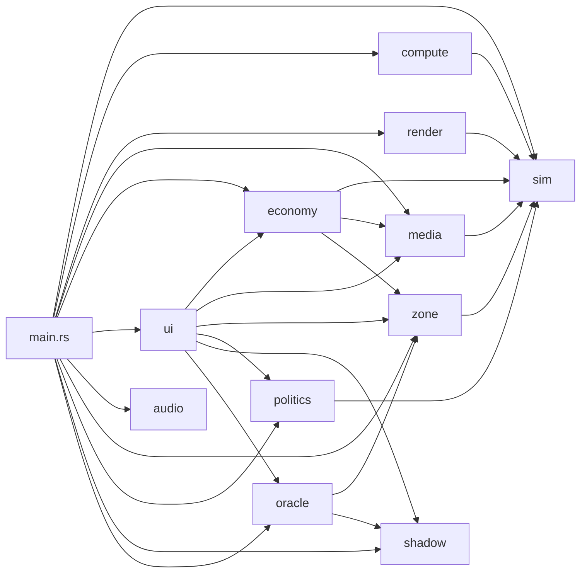

# `src/` — SimSitting Source Modules

## Module Dependency Graph



## Module Reference

### Core Simulation
| Module | Description |
|---|---|
| `main.rs` | App builder, plugin registration, system scheduling |
| `sim.rs` | `SimAgent` ECS component, `SimAgentGpu` (32B GPU struct), Deffuant-Weisbuch opinion dynamics |
| `compute.rs` | `SimComputeNode` render graph node, GPU buffer management, analytics staging/readback |
| `render.rs` | Agent sprite rendering, opinion-to-color mapping, camera shake (Perlin trauma) |

### Game Systems
| Module | Description |
|---|---|
| `economy.rs` | Revenue model ($0.05/agent/tick × engagement), Narrative Capital, quarterly reports, Consensus Trap |
| `media.rs` | Media node placement (Echo Chamber, Public Square, Rage Bait), cognitive gravity |
| `zone.rs` | 256×256 `InfluenceMap`, `ZoneCell` (outrage/narrowing/revenue_mult), `ZoneBrush`, circle painting |
| `audio.rs` | Web Audio API bridge, procedural synth, Dorian/Lydian/Phrygian modes |

### Political Engine (Phase 3)
| Module | Description |
|---|---|
| `politics.rs` | `PoliticalData` (GPU histogram, 10 atomic u32 buckets), `Party`, `PartyMandate`, `ElectionState`, `GovernmentContracts`, singularity detection |
| `shadow.rs` | `ShadowFilter` (forbidden range → drift), `FilterPipeline`, `PublicTrust`, `ShadowMode` |

### The Finale (Phase 4)
| Module | Description |
|---|---|
| `oracle.rs` | `OracleState`, greedy autopilot, `SessionHistory`, `PsychographicProfile`, `generate_epilogue` |
| `ui.rs` | BROADCAST_OS dashboard, zone toolbar, election banners, Oracle unlock, aesthetic morph, Singularity overlay |

## Test Distribution

```
politics.rs   ████████████████████████████████████████████ 42
oracle.rs     █████████████████████████ 25
zone.rs       ██████████████████████ 22
audio.rs      ███████████████████ 19
shadow.rs     ███████████████████ 19
economy.rs    ████████████████ 16
sim.rs        █████████████ 13
compute.rs    ███████ 7
render.rs     █████ 5
media.rs      ███ 3
─────────────────────────────────────────────
Total: 171 tests
```
